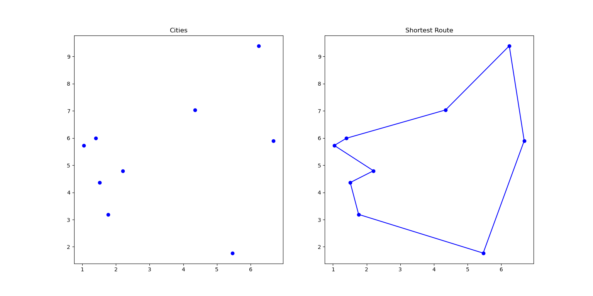

[](https://www.python.org/)
[](https://github.com/armandwayoff/Travelling-Salesman-Problem/blob/master/LICENSE)

# Travelling Salesman Problem

[Wikipedia page on the travelling salesman problem ?](https://en.wikipedia.org/wiki/Travelling_salesman_problem)

## Table of Contents

* [About the Project](#about-the-project)
* [Algorithms](#algorithms)
  * [2-opt](https://github.com/armandwayoff/Travelling-Salesman-Problem/tree/master/2-opt)
  * [Brute-Force Search](https://github.com/armandwayoff/Travelling-Salesman-Problem/tree/master/Brute-Force%20Search)
  * [Nearest Neighbour Algorithm](https://github.com/armandwayoff/Travelling-Salesman-Problem/tree/master/Nearest%20Neighbour%20Algorithm)
  * [Simulated Annealing](https://github.com/armandwayoff/Travelling-Salesman-Problem/tree/master/Simulated%20Annealing)
* [License](#license)


## About the Project

The aim of this project is to present the problem of the commercial traveller as well as different resolution algorithms. 



## Algorithms

The ```Algorithms``` folder contains one folder per algorithm. Each folder contains a file named ```[algorithm name]_function.py``` and a file named ```[algorithm name]_visualization.py```.

## License

Distributed under the MIT License. See [```LICENSE```](https://github.com/armandwayoff/Travelling-Salesman-Problem/blob/master/LICENSE) for more information.
