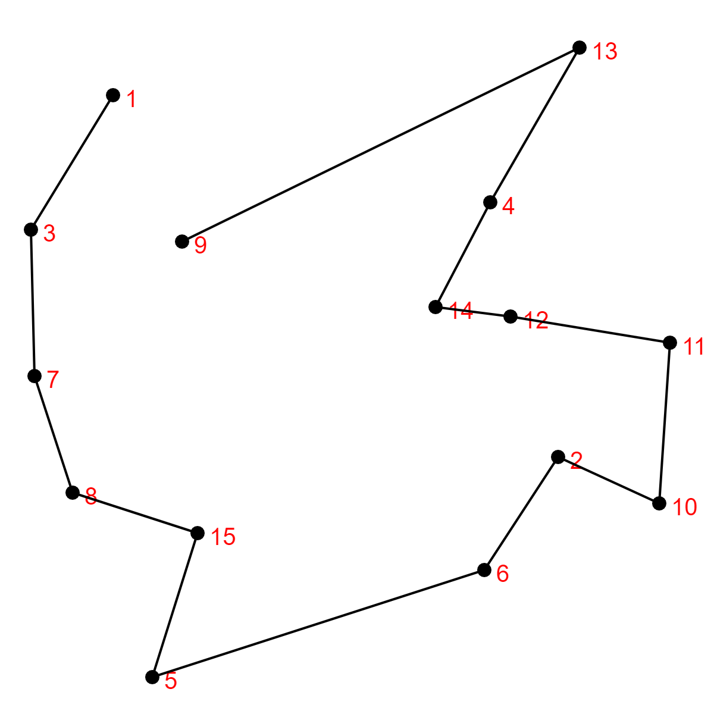

# Travelling Salesman Problem

My Work on the Travelling Salesman Problem

## Table of Contents

* [Converting Non-Planar Graph to Planar](#converting-non-planar-graph-to-planar)
* [Nearest Neighbour Algorithm](#nearest-neighbour-algorithm)

## Converting Non-Planar Graph to Planar

* What's a [Planar graph](https://en.wikipedia.org/wiki/Planar_graph) ?

This algorithm is a sub-algorithm that can be implemented in a more general algorithm for solving the travelling salesman problem.

## Nearest Neighbour Algorithm

* What's the [Nearest neighbour algorithm](https://en.wikipedia.org/wiki/Nearest_neighbour_algorithm) ?

Example of implementation of the algorithm for 15 vertices generated randomly.

> By default, the algorithm starts with the first vertex.

